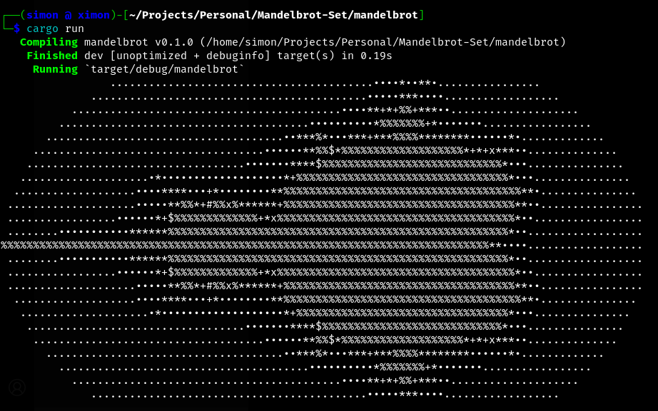

# Mandelbrot-Set

Ensure you have `rustc` and `cargo` installed on your local machine.

## Instructions

After cloning the project, run

```bash
cargo run
```

A <a href="https://en.wikipedia.org/wiki/Mandelbrot_set" target="_blank">Mandelbrot set</a> will be displayed on your terminal!



Courtesy: <a href ="https://www.manning.com/books/rust-in-action" target="_blank">Rust in Action</a>
